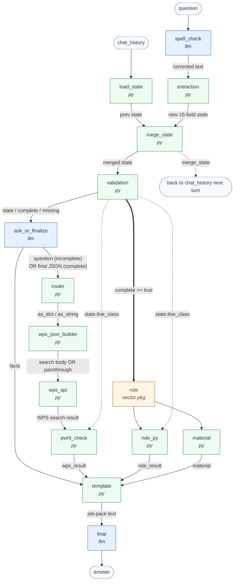

# Flow structure & onboarding

## 1. What the flow does

A conversational **job-pack generator** for TCO piping repairs. The user
describes a repair; the flow spell-corrects it, extracts ~15 structured fields,
carries them across conversation turns, asks for whatever is missing, and once
the state is complete it looks up WPS/PWHT + NDE + material data from Azure AI
Search and assembles the final job-pack scope text.

- **Inputs:** `question` (this turn's user text), `chat_history` (prior turns).
- **Outputs:** `answer` (chat reply — a follow-up question OR the job pack),
  `merge_state` (accumulated state, read back next turn via `chat_history`).
- The DAG is acyclic within one run; the "loop" is across conversation turns.

## 2. Diagram

Legend: blue = LLM (Azure OpenAI) node, green = Python node, orange = package
(vector index) node, dashed = flow input/output. `== complete ==>` edges are the
`activate: when complete is true` gate on `nde`/`nde_py`.

### The two paths through the flow

- **Incomplete state (still gathering info):** `ask_or_finalize` returns a plain
  question string. `router` marks it `kind=string`; `wps_json_builder`/`wps_api`
  pass it through; `pwht_check` returns it unchanged; `nde`/`nde_py` are skipped
  (not complete). `template` sees non-JSON `facts` and returns the question
  as-is, which `final` echoes back to the user.
- **Complete state:** `ask_or_finalize` returns the state as JSON; the WPS and
  NDE lookups run for real; `template` builds the full scope text; `final`
  formats it into the numbered job-pack layout.

## 3. Node -> adapter -> core mapping

| DAG node          | Type    | Source path                 | Core function (`pf_jobpack`)          |
|-------------------|---------|-----------------------------|---------------------------------------|
| `spell_check`     | llm     | `prompts/spell_check.jinja2`| —                                     |
| `extraction`      | python  | `nodes/extraction.py`       | `extraction.build_scope_json_from_input` |
| `load_state`      | python  | `nodes/load_state.py`       | `state.load_state`                    |
| `mege_state`      | python  | `nodes/merge_state.py`      | `state.merge_state`                   |
| `validation`      | python  | `nodes/validation.py`       | `state.validate_state`                |
| `ask_or_finalize` | llm     | `prompts/ask_or_finalize.jinja2` | —                                |
| `router`          | python  | `nodes/router.py`           | `state.route_prev`                    |
| `wps_json_builder`| python  | `nodes/wps_json_builder.py` | `search.build_wps_query`              |
| `wps_api`         | python  | `nodes/wps_api.py`          | `search.acs_search`                   |
| `pwht_check`      | python  | `nodes/pwht_check.py`       | `pwht.check_pwht_flag`                |
| `nde`             | package | `promptflow_vectordb…search`| — (vector index lookup)               |
| `nde_py`          | python  | `nodes/nde_py.py`           | `nde.check_nde_search`                |
| `material`        | python  | `nodes/material.py`         | `material.check_material_ss`          |
| `template`        | python  | `nodes/template.py`         | `template.build_job_pack`             |
| `final`           | llm     | `prompts/final.jinja2`      | —                                     |

DAG node names are unchanged from the original export (notably `mege_state`,
whose output feeds the `merge_state` flow output that `load_state` reads next
turn). Only `source.path` values changed.

## 4. The 15-field state

Produced by `extraction`, required by `validation`:

`line_class`, `scope_type`, `insulation`, `heat_tracing`, `hydrogen_bake_out`,
`ie_doc_no`, `dia_in`, `existing_spring_support_reuse`, `placeholders_TP`,
`spool_prefab`, `has_tie_ins`, `pump_compressor_vessel_psv_in_scope`,
`new_piping_route`, `insufficient_vessel_internal_data`,
`replace_existing_equipment_diff_weight`.

## 5. Relevant vs. irrelevant archive files

The original DAG references only **14** files. The other **25** files in
`archive/baseline-2026-08-24/` are unreferenced experiments / duplicates and are
NOT part of the flow.

- **Used (14):** `spell_check.jinja2`, `extraction.py`, `load_state.py`,
  `mege_state.py`, `validation.py`, `ask_or_finalize.jinja2`, `router.py`,
  `wps_json_builder.py`, `wps_api.py`, `pwht_check.py`, `nde_py.py`,
  `material.py`, `template.py`, `final.jinja2`.
- **Unused (25):** `api.py`, `decide.py`, `decision_llm.py`, `exract_class.py`
  (typo dup), `extract_class.py`, `filter_size.py`, `get_current_state.py`,
  `merging_chats.py`, `pwht_checkl.py` (typo dup), `scope_json.py`,
  `temlate.py` (typo dup), `word.py`, `wps.py`, `wps_dia_json.py`, and the
  prompts `chat.jinja2`, `class_extraction.jinja2`, `extraction_llm.jinja2`,
  `index_lookup.jinja2`, `legacy_line_class.jinja2`, `line_class_llm.jinja2`,
  `ouput.jinja2`, `output2.jinja2`, `question.jinja2`,
  `rdsfgvdcfxfgdfz.jinja2`, `scope_type_llm.jinja2`, `template_llm.jinja2`.

## 6. Audit — suspected bugs in the ORIGINAL logic

These are pre-existing issues in the other engineer's code. They were
**reproduced faithfully** in `pf_jobpack/` (not silently fixed) because
correcting them needs domain decisions. Verified by running the core in a venv.

1. **`scope_type` type mismatch (HIGH).** `extraction` returns `scope_type` as a
   **list**, but `template.py` compares it to **strings** in many places
   (`facts['scope_type'] == 'machinery nozzle'`, `!= 'Valve replacement'`, etc.).
   A list never equals a string, so:
   - `!= 'Valve replacement'` is always `True` -> the SHOP WORK block runs even
     for a pure valve replacement (the code comment says it should be excluded).
   - Every `== '<scope>'` branch is dead code.
   **Intended vocabulary confirmed** by the unused `scope_type_llm.jinja2`: the
   allowed scope types are exactly the six the extractor emits — `Flange
   replacement`, `Valve replacement`, `Piping section replacement`, `TLR`,
   `Elbow replacement`, `Pipe extension` — and "Multiple scope types can exist"
   (it is meant to be a **list**). So the template is the wrong side: its string
   equality checks should be membership checks, and its nine other scope values
   (`machinery nozzle`, `PSV connection`, `pipeline`, `gas injection`,
   `wellhead`, `heavy wall piping`, `vessel replacement`, `swing elbow`,
   `fixed equipment nozzle or vessel nozzle`) are **not part of the taxonomy** —
   those branches must be driven by other fields (e.g.
   `pump_compressor_vessel_psv_in_scope`) or removed.

2. **`material` fed from the NDE index — mapping conflict (MEDIUM, needs index
   check).** The `material` node input is `search_output: ${nde.output}`. The
   source NDE data (`docs/jp/Procedures/nde.csv`) *does* embed material text in
   its `content` column (e.g. "... Material Alloy 20. PMI 100.0."), so feeding
   `material` from the NDE data is not inherently wrong. **But** the DAG's `nde`
   node `field_mapping` sets `content: line_class` (and `metadata: pmi_percent`),
   which would expose only the bare line class as the retrieved content — not the
   rich "Material X" sentence `check_material_ss` needs. `nde_py` is happy with
   `content == line_class`; `material` is starved by it. The two downstream
   consumers want different content out of the same lookup. Needs inspection of
   the *deployed* index schema to confirm what `nde.output` actually contains.
   Separately, `check_material_ss` uses a strict `fullmatch` on `CS|LTCS|LTCS
   NACE`, so real values like "CS BITUM COATED" fall through to `Null`.

3. **`existing_spring_support_reuse` is hardcoded `True` (LOW).** `extraction`
   always sets it to `True` and `load_state` re-forces `True`, so the template's
   `if facts['existing_spring_support_reuse'] == False` branch is dead — the
   spring-stopping-pin instruction can never be emitted.

4. **Inconsistent "required" semantics (MEDIUM/UX).** `validation` treats a value
   as missing only if it is `None`/`""`/`"null"`. So `dia_in == []` and
   `ie_doc_no == False` count as **present** (never block completion), while
   `insulation`/`heat_tracing` come back `None` when not explicitly stated and
   therefore **always** block completion. Net effect: some "required" fields
   can't be satisfied from typical input and the flow keeps re-asking.

5. **`nde_py` exact-type compare (LOW).** `input1[0].get("metadata") == 100`
   assumes `pmi_percent` is the int `100`; a `"100"` string or `100.0` float from
   the index would silently yield `No`.

6. **Hardcoded secret (SECURITY).** `wps_api` carries a plaintext Azure AI Search
   `api_key` in `flow.dag.yaml` (and in `archive/` + git history). Rotate it and
   move it to a Prompt Flow connection / environment variable.

## 7. Changes vs the original export (restructure)

- Logic split into a PF-independent `pf_jobpack/` package + thin `nodes/`
  adapters (was one monolithic file per node at the repo root).
- `extraction` dropped `pandas`/`numpy` (only used for size parsing; the code
  even referenced `np.nan` without importing numpy). Pure Python now, identical
  behavior for real inputs.
- `nde.check_nde_search` gained two defensive guards (empty result / missing
  `text`) so malformed lookups return `None` instead of raising.
- Every node's behavior is otherwise a faithful reproduction of
  `archive/baseline-2026-08-24/`, including the bugs in §6.
