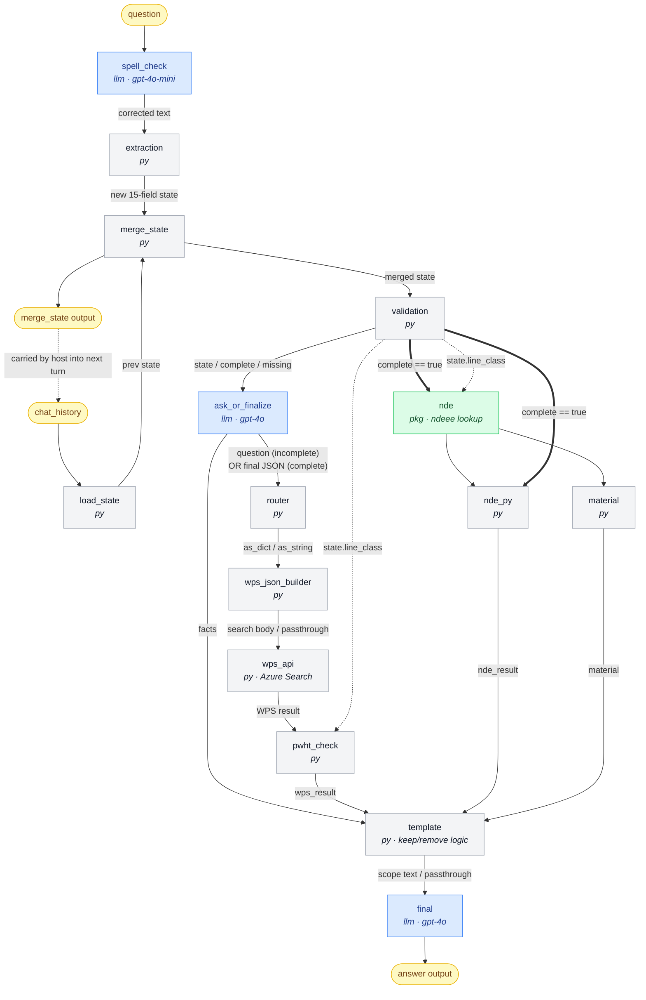

# Flow structure & onboarding

## 1. What the flow does

A conversational **job-pack generator** for TCO piping repairs. The user
describes a repair; the flow spell-corrects it, extracts ~15 structured fields,
carries them across conversation turns, asks for whatever is missing, and once
the state is complete it looks up WPS/PWHT + NDE + material data from Azure AI
Search and assembles the final job-pack scope text.

- **Inputs:** `question` (this turn's user text), `chat_history` (prior turns).
- **Outputs:** `answer` (chat reply — a follow-up question OR the job pack),
  `merge_state` (accumulated state, read back next turn via `chat_history`).
- The DAG is acyclic within one run; the "loop" is across conversation turns.

## 2. Diagram



Legend: blue = LLM (Azure OpenAI) node, gray = Python node, green = package
(vector index) node, yellow = flow input/output. The bold `== complete ==>`
edges are the `activate: when complete is true` gate on `nde`/`nde_py`; the
dotted `merge_state output → chat_history` edge is the cross-turn loop the host
carries (the DAG itself is acyclic within one run).

### The two paths through the flow

- **Incomplete state (still gathering info):** `ask_or_finalize` returns a plain
  question string. `router` marks it `kind=string`; `wps_json_builder`/`wps_api`
  pass it through; `pwht_check` returns it unchanged; `nde`/`nde_py` are skipped
  (not complete). `template` sees non-JSON `facts` and returns the question
  as-is, which `final` echoes back to the user.
- **Complete state:** `ask_or_finalize` returns the state as JSON; the WPS and
  NDE lookups run for real; `template` builds the full scope text; `final`
  formats it into the numbered job-pack layout.

## 3. Node -> adapter -> core mapping

| DAG node          | Type    | Source path                 | Core function (`pf_jobpack`)          |
|-------------------|---------|-----------------------------|---------------------------------------|
| `spell_check`     | llm     | `prompts/spell_check.jinja2`| —                                     |
| `extraction`      | python  | `nodes/extraction.py`       | `extraction.build_scope_json_from_input` |
| `load_state`      | python  | `nodes/load_state.py`       | `state.load_state`                    |
| `merge_state`     | python  | `nodes/merge_state.py`      | `state.merge_state`                   |
| `validation`      | python  | `nodes/validation.py`       | `state.validate_state`                |
| `ask_or_finalize` | llm     | `prompts/ask_or_finalize.jinja2` | —                                |
| `router`          | python  | `nodes/router.py`           | `state.route_prev`                    |
| `wps_json_builder`| python  | `nodes/wps_json_builder.py` | `search.build_wps_query`              |
| `wps_api`         | python  | `nodes/wps_api.py`          | `search.acs_search`                   |
| `pwht_check`      | python  | `nodes/pwht_check.py`       | `pwht.check_pwht_flag`                |
| `nde`             | package | `promptflow_vectordb…search`| — (vector index lookup)               |
| `nde_py`          | python  | `nodes/nde_py.py`           | `nde.check_nde_search`                |
| `material`        | python  | `nodes/material.py`         | `material.check_material_ss`          |
| `template`        | python  | `nodes/template.py`         | `template.build_job_pack`             |
| `final`           | llm     | `prompts/final.jinja2`      | —                                     |

DAG node names match the original export, **except** the misspelled node
`mege_state` was renamed to `merge_state` (its two references — the
`merge_state` flow output and the `validation` node input — were updated too).
The `merge_state` flow output key is unchanged, so the cross-turn contract that
`load_state` reads still holds. `source.path` values were also updated during
the restructure.

## 4. The 15-field state

Produced by `extraction`, required by `validation`:

`line_class`, `scope_type`, `insulation`, `heat_tracing`, `hydrogen_bake_out`,
`ie_doc_no`, `dia_in`, `existing_spring_support_reuse`, `placeholders_TP`,
`spool_prefab`, `has_tie_ins`, `pump_compressor_vessel_psv_in_scope`,
`new_piping_route`, `insufficient_vessel_internal_data`,
`replace_existing_equipment_diff_weight`.

## 5. Relevant vs. irrelevant archive files

The original DAG references only **14** files. The other **25** files in
`archive/baseline-2026-08-24/` are unreferenced experiments / duplicates and are
NOT part of the flow.

- **Used (14):** `spell_check.jinja2`, `extraction.py`, `load_state.py`,
  `mege_state.py`, `validation.py`, `ask_or_finalize.jinja2`, `router.py`,
  `wps_json_builder.py`, `wps_api.py`, `pwht_check.py`, `nde_py.py`,
  `material.py`, `template.py`, `final.jinja2`.
- **Unused (25):** `api.py`, `decide.py`, `decision_llm.py`, `exract_class.py`
  (typo dup), `extract_class.py`, `filter_size.py`, `get_current_state.py`,
  `merging_chats.py`, `pwht_checkl.py` (typo dup), `scope_json.py`,
  `temlate.py` (typo dup), `word.py`, `wps.py`, `wps_dia_json.py`, and the
  prompts `chat.jinja2`, `class_extraction.jinja2`, `extraction_llm.jinja2`,
  `index_lookup.jinja2`, `legacy_line_class.jinja2`, `line_class_llm.jinja2`,
  `ouput.jinja2`, `output2.jinja2`, `question.jinja2`,
  `rdsfgvdcfxfgdfz.jinja2`, `scope_type_llm.jinja2`, `template_llm.jinja2`.

## 6. Audit — bugs in the ORIGINAL logic (+ fix status)

These were pre-existing issues in the other engineer's code. After confirming
the open unknowns against live Azure (2026-08-25), several are now **fixed** in
`pf_jobpack/` and pinned by the test suite (§8); the rest are left open because
they need a domain decision. Each item is tagged with its current status.

1. **`scope_type` type mismatch (HIGH) — FIXED (list handling).** `extraction`
   returns `scope_type` as a **list**, but `template.py` compared it to
   **strings** (`facts['scope_type'] == 'machinery nozzle'`,
   `!= 'Valve replacement'`, etc.). A list never equals a string, so
   `!= 'Valve replacement'` was always `True` (SHOP WORK ran even for a pure
   valve replacement) and every `== '<scope>'` branch was dead.
   **Fix:** `template.py` now normalises `scope_type` to a set and uses
   membership (`has_scope(...)`); the "skip SHOP WORK" gate is
   `scope_types != {'Valve replacement'}`. Works whether the LLM emits a list or
   a string. Pinned by `tests/test_template.py`.
   **Still open (needs your decision):** the nine out-of-taxonomy values
   (`machinery nozzle`, `PSV connection`, `pipeline`, `gas injection`,
   `wellhead`, `heavy wall piping`, `vessel replacement`, `swing elbow`,
   `fixed equipment nozzle or vessel nozzle`) are **not** in the six-value
   taxonomy the extractor emits, so those branches are still dead. They must be
   driven by other fields (e.g. `pump_compressor_vessel_psv_in_scope`) or
   removed — I left them in place pending that call.

2. **`material` + `nde_py` broken by the `ndeee` field mapping and string types
   (HIGH — CONFIRMED against live Azure 2026-08-25 — FIXED, see
   [azure-environment.md](azure-environment.md) §5).** There is **no
   separate material index**; material genuinely lives in `ndeee`, so
   `material: ${nde.output}` is the right source. The break is in *how* the data
   comes back:
   - The `nde` mlindex `field_mapping` is `content: line_class`,
     `metadata: pmi_percent`. So the lookup surfaces the **bare line class** as
     the document content, not the rich `"... Material Alloy 20. PMI 100.0."`
     sentence (which does exist in the index `content` field but is masked by the
     mapping; the dedicated `material` field is `retrievable=false`).
     -> `check_material_ss` never sees a `"Material X"` string to parse.
   - `pmi_percent` is **`Edm.String` `"100"`**, not int `100`. And it arrives as
     `metadata`, which `check_material_ss` only handles when it's a `dict` or
     `int` — a string falls through -> returns `No`.
   Net (before fix): `material` effectively always returned `No`, and `nde_py`'s
   `metadata == 100` was always `False` (string vs int) — PMI never "Yes".
   **Fix:**
   - `flow.dag.yaml` `nde` node `field_mapping.content` changed
     `line_class -> content` so the rich sentence is retrieved.
   - New `pf_jobpack/lookup.py` reads content across result shapes and coerces
     PMI (str/int/float, or parsed from "PMI 100.0") to a number.
   - `nde.py` compares PMI numerically (`>= 100`); `material.py` reads the rich
     content via the helper.
   - `material.py` CS match loosened from `fullmatch` to a word-boundary search
     (`\b(LTCS|CS)\b`), so `CS BITUM COATED`, `LTCS GALV`,
     `LTCS NACE - API 5L X60`, `PTFE lined LTCS`, `ASTM A105 CS` all classify as
     `CS` (behavioural change — SS is checked first). Pinned by
     `tests/test_material.py`, `tests/test_nde.py`, `tests/test_lookup.py`, and
     the live test `tests/test_live_azure.py`.

3. **`existing_spring_support_reuse` is hardcoded `True` (LOW).** `extraction`
   always sets it to `True` and `load_state` re-forces `True`, so the template's
   `if facts['existing_spring_support_reuse'] == False` branch is dead — the
   spring-stopping-pin instruction can never be emitted.

4. **Inconsistent "required" semantics (MEDIUM/UX).** `validation` treats a value
   as missing only if it is `None`/`""`/`"null"`. So `dia_in == []` and
   `ie_doc_no == False` count as **present** (never block completion), while
   `insulation`/`heat_tracing` come back `None` when not explicitly stated and
   therefore **always** block completion. Net effect: some "required" fields
   can't be satisfied from typical input and the flow keeps re-asking.

5. **`nde_py` exact-type compare (HIGH — CONFIRMED — FIXED).**
   `input1[0].get("metadata") == 100` assumed `pmi_percent` was the int `100`,
   but the live index returns the **string `"100"`** (content spells it
   `PMI 100.0`), so this compare was always `False`. Fixed as part of #2 (numeric
   coercion in `pf_jobpack/lookup.py`).

6. **Hardcoded secret (SECURITY).** `wps_api` carries a plaintext Azure AI Search
   `api_key` in `flow.dag.yaml` (and in `archive/` + git history). Rotate it and
   move it to a Prompt Flow connection / environment variable.

7. **`pwht` blank / "N see Note (7)" rows (LOW — CONFIRMED — FIXED).** Across the
   266 `wps-diain` docs, `pwht` is `N` (128), `Y` (103), **blank (18)**, and
   **`"N see Note (7)"` (17)**. Previously a blank value returned `None`, which
   silenced both the PWHT branches *and* the `wps_result == 'No'` field-weld NDE
   branch (57a), dropping NDE from the job pack for those classes.
   **Fix:** after a line-class match, a blank/empty `pwht` now defaults to `"No"`
   (not required) so the field-weld NDE still emits; `"N see Note (7)"` already
   starts with `N` -> `"No"`. Pinned by `tests/test_pwht.py`. **Confirm** `"No"`
   is the intended default for blank PWHT — flip it if the business rule differs.

## 7. Changes vs the original export (restructure)

- Logic split into a PF-independent `pf_jobpack/` package + thin `nodes/`
  adapters (was one monolithic file per node at the repo root).
- `extraction` dropped `pandas`/`numpy` (only used for size parsing; the code
  even referenced `np.nan` without importing numpy). Pure Python now, identical
  behavior for real inputs.
- `nde.check_nde_search` gained two defensive guards (empty result / missing
  `text`) so malformed lookups return `None` instead of raising.
- Shared `pf_jobpack/lookup.py` added for shape-tolerant result parsing (used by
  `nde` + `material`).
- Behaviour is otherwise a faithful reproduction of
  `archive/baseline-2026-08-24/`, except the §6 items marked **FIXED**.

## 8. Running the checks

The logic is now covered by a test suite so it can be verified after any edit —
especially useful when a smaller model (e.g. GPT-5.4 mini) is changing the code.
Everything is isolated in a virtualenv (never install into the base system).

```bash
cd tco_jp_project
python3 -m venv .venv && source .venv/bin/activate   # or python3 -m venv /tmp/venv
pip install -r requirements-dev.txt

# Offline unit + logic tests (no network, no Azure) — the guardrail loop:
pytest                     # 100+ tests across extraction/state/search/nde/material/pwht/template

# Optional LIVE smoke test against real Azure AI Search (opt-in, needs a key):
export AZURE_SEARCH_API_KEY='<query key>'            # never commit this
pytest -m live -v          # validates material/NDE/PWHT on real ndeee + wps-diain docs
```

What the suite protects:

| Test file | Locks in |
|---|---|
| `test_lookup.py` | PMI parsed as a number from string/int/float/content; content found across result shapes |
| `test_nde.py` | PMI 100 -> "Yes"; line-class mismatch/empty -> guarded |
| `test_material.py` | CS / SS / Null classification across the real `nde.csv` vocabulary |
| `test_pwht.py` | Y/N, blank->"No", "N see Note (7)"->"No", pass-through/mismatch |
| `test_search.py` | WPS query body + diameter filter + string pass-through |
| `test_state.py` | merge (sticky/monotonic/union), validate (missing), route |
| `test_extraction.py` | line class, scope-type list, insulation, diameter, IE doc no, all 15 fields |
| `test_template.py` | **scope_type list** handling (valve-only skips SHOP WORK), material/NDE/PWHT wiring |
| `test_live_azure.py` | the above against the *real* indexes (opt-in) |
